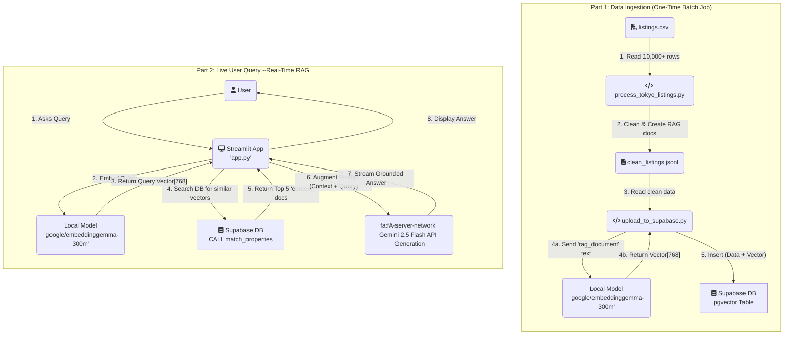

## Tokyo Hotel AI Chatbot (Full-Stack RAG Pipeline)

This project is a full-stack, conversational AI chatbot designed for semantic search of Tokyo hotel and Airbnb listings (static sample data).

Unlike traditional keyword search, this application uses a `Retrieval-Augmented Generation (RAG)` pipeline. This means users can ask questions in natural language (e.g., "*Find me a quiet place near a park with a good kitchen*") and receive answers that are "grounded" in a real, verifiable dataset, preventing AI hallucinations and providing accurate results.

This project was built to demonstrate a modern, end-to-end AI application, from raw data ingestion and vector embedding to a real-time, interactive web interface.

### Architecture & Data Flow

The application is built on a "two-stage" architecture: a one-time Ingestion pipeline and a real-time **Query** pipeline.



### Tech Stack

* Application Framework: `Streamlit`
* Data Pipeline & Processing: `Python`, `pandas`
* Vector Database: `Supabase` (PostgreSQL with `pgvector` extension)
* Embedding Model (Retrieval): `google/embeddinggemma-300m` (Local model via sentence-transformers)
* Generative Model (Generation): `Google Gemini 2.5 Flash` (via `google-generativeai` API)

### Engineering Rationale

This project was built around several key engineering decisions:

1. **Why RAG?**
    * Grounding: The RAG architecture prevents the generative AI from "hallucinating" or making up hotels. All answers are grounded in the context retrieved from the database.
    * Scalability: The knowledge base (the hotel listings) is decoupled from the reasoning engine (the LLM). We can update the hotel data without having to retrain or fine-tune the model.

2. **Why a Local Embedding Model?**
    * **Cost**: Using a local model like `embeddinggemma-300m` is free, both for the one-time ingestion of 10,000+ documents and for every real-time user query.
    * **Performance**: The model is highly efficient, adding minimal latency to the user's search.

    * **Consistency** (The Golden Rule): The same model is used to embed the documents for storage and to embed the user's query at runtime. This consistency is essential for the vector search to find relevant matches.

3. **Why `gemini-2.5-flash-lite` for Generation?**

    * This is a "grounded" summarization task, not a complex creative task. `2.5-flash-lite` offers the perfect trade-off of speed and cost, providing a fast, conversational feel to the chat interface while remaining highly economical.

### How to Run This Project Locally

1. Prerequisites

    * Python 3.10+
    * A free Supabase account.
    * A Google AI Studio API Key (GOOGLE_API_KEY).
    * The `listings.csv` dataset from Kaggle (Tokyo Airbnb Open Data, included in the repository).

2. Initial Setup
    1. Clone the repository:

        ```sh
        git clone [https://github.com/your-username/your-repo-name.git](https://github.com/your-username/your-repo-name.git)
        cd your-repo-name
        ```

    2. Install dependencies:
        ```sh
        pip install -r requirements.txt
        ```


    3. Create your .env file: Create a file named .env in the root directory and add your secret keys:
        ```
        # Get from Supabase Project -> Settings -> API
        SUPABASE_URL="httpsYour-Project-URL.supabase.co"
        SUPABASE_SERVICE_KEY="Your-Supabase-SERVICE-ROLE-Key"

        # Get from Google AI Studio
        GOOGLE_API_KEY="Your-Google-Gemini-API-Key"
        ```


3. Data Ingestion (One-Time Setup)

    This process populates your Supabase database with the hotel data and its vector embeddings.
    
    1. Run the Database Setup:
        * Log in to your Supabase project.
        * Go to the `SQL Editor` > `New Query`.
        * Copy the entire contents of `setup_database_gemma.sql` into the editor and click `Run`.
        * This will create your `properties` table and the `match_properties` search function.

    2. Download and Process the Data:

        * Download the `listings.csv` file from the Kaggle link above.
        * Place `listings.csv` in the root of your project directory.
        * Run the processing script to clean the data:
            ```sh
            python process_tokyo_listings.py
            ```
        * This will create a new file: `clean_listings.jsonl`.

    3. Upload and Embed the Data:
        * Run the upload script. This will read `clean_listings.jsonl`, generate 768-dimension embeddings for each listing using your local `embeddinggemma` model, and upload them to Supabase.
        * This will take some time.
            ```sh
            python upload_to_supabase.py
            ```


    4. Run the Chatbot

        Once the data ingestion is complete, you can start the web application:
        ```sh
        streamlit run app.py
        ```


Your browser will automatically open, and you can now chat with your RAG-powered application.

### Future Implementation

* Hybrid Search: Combine the current vector search (semantic) with traditional SQL WHERE clauses (keyword/filter). This would allow for queries like, "Find me a place in Shinjuku for under 15,000 JPY."
* Chat History: Implement conversational memory so the user can ask follow-up questions (e.g., "Which one of those has WiFi?").
* Containerization: Dockerize the application and its dependencies for deployment.