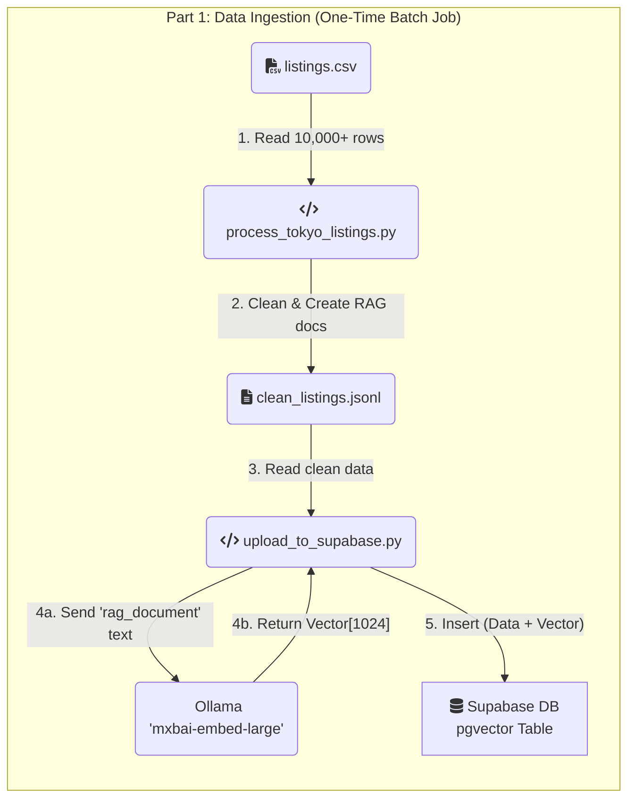
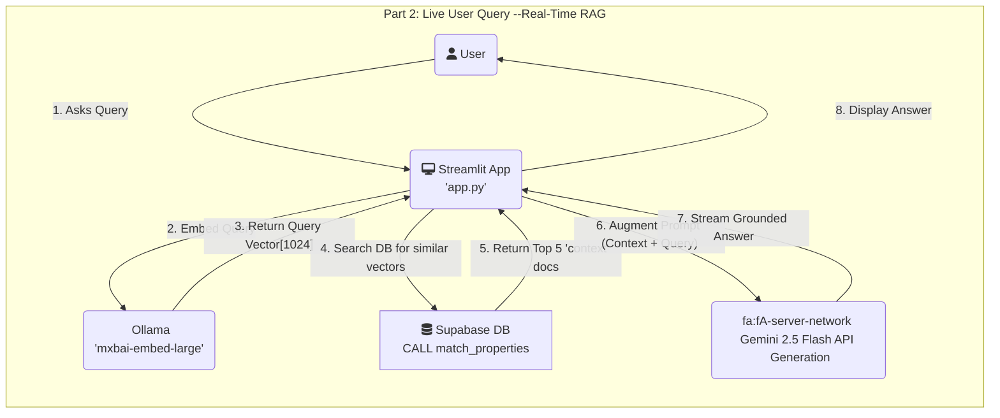

## Tokyo Hotel AI Chatbot (Full-Stack RAG Pipeline)

This project is a full-stack, conversational AI chatbot designed for semantic search of Tokyo hotel and Airbnb listings (static sample data).

Unlike traditional keyword search, this application uses a `Retrieval-Augmented Generation (RAG)` pipeline. This means users can ask questions in natural language (e.g., "*Find me a quiet place near a park with a good kitchen*") and receive answers that are "grounded" in a real, verifiable dataset, preventing AI hallucinations and providing accurate results.

This project was built to demonstrate a modern, end-to-end AI application, from raw data ingestion and vector embedding to a real-time, interactive web interface.

### Architecture & Data Flow

The application is built on a "two-stage" architecture: a one-time Ingestion pipeline and a real-time **Query** pipeline.





### Tech Stack

*   Application Framework: `Streamlit`
*   Containerization: `Docker`, `Docker Compose`
*   Data Pipeline & Processing: `Python`, `pandas`
*   Vector Database: `Supabase` (PostgreSQL with `pgvector` extension)
*   Embedding Model (Retrieval): `mxbai-embed-large` (via `Ollama`)
*   Generative Model (Generation): `Google Gemini 2.5 Flash` (via `google-generativeai` API)

### Engineering Rationale

This project was built around several key engineering decisions:

1.  **Why RAG?**
    *   Grounding: The RAG architecture prevents the generative AI from "hallucinating" or making up hotels. All answers are grounded in the context retrieved from the database.
    *   Scalability: The knowledge base (the hotel listings) is decoupled from the reasoning engine (the LLM). We can update the hotel data without having to retrain or fine-tune the model.

2.  **Why a Local Embedding Model via Ollama?**
    *   **Cost**: Using a local model like `mxbai-embed-large` served via Ollama is free, both for the one-time ingestion of 10,000+ documents and for every real-time user query.
    *   **Performance**: The model is highly efficient, and running it as a separate service with Ollama allows for dedicated resource management.
    *   **Flexibility**: Ollama makes it simple to swap out and experiment with different open-source embedding models.
    *   **Consistency** (The Golden Rule): The same model is used to embed the documents for storage and to embed the user's query at runtime. This consistency is essential for the vector search to find relevant matches.

3.  **Why `gemini-2.5-flash-lite` for Generation?**

    *   This is a "grounded" summarization task, not a complex creative task. `2.5-flash-lite` offers the perfect trade-off of speed and cost, providing a fast, conversational feel to the chat interface while remaining highly economical.

4.  **Why Docker?**
    *   **Reproducibility**: Docker containers bundle the application and its dependencies, ensuring that it runs the same way everywhere, from local development to production.
    *   **Simplified Setup**: A single `docker-compose up` command is all that's needed to build and run the entire application stack, eliminating complex local setup and dependency issues.
    *   **Isolation**: The application runs in an isolated environment, preventing conflicts with other projects or system-wide packages.

### How to Run This Project Locally

You can access the live demo of this chatbot online at: [https://chatbot.crazyhungry.party/](https://chatbot.crazyhungry.party/)

1.  **Prerequisites**

    *   [Docker](https://docs.docker.com/get-docker/) and [Docker Compose](https://docs.docker.com/compose/install/) installed.
    *   [Ollama](https://ollama.com/) installed and running on your host machine.
    *   A free [Supabase](https://supabase.com/) account.
    *   A [Google AI Studio API Key](https://aistudio.google.com/app/apikey) (for the generative part of the RAG pipeline).

2.  **Initial Setup**
    1.  Clone the repository:
        ```sh
        git clone [https://github.com/your-username/your-repo-name.git](https://github.com/your-username/your-repo-name.git)
        cd your-repo-name
        ```

    2.  Pull the embedding model with Ollama:
        ```sh
        ollama pull mxbai-embed-large
        ```
        *(Ensure the Ollama application is running before executing this command.)*

    3.  Create your `.env` file: Create a file named `.env` in the root directory and add your secret keys. This file is git-ignored for security.
        ```
        # Get from Supabase Project -> Settings -> API
        SUPABASE_URL="httpsYour-Project-URL.supabase.co"
        SUPABASE_SERVICE_KEY="Your-Supabase-SERVICE-ROLE-Key"

        # Get from Google AI Studio
        GOOGLE_API_KEY="Your-Google-Gemini-API-Key"
        ```

3.  **Data Ingestion (One-Time Setup)**

    This process populates your Supabase database with the hotel data and its vector embeddings.

    1.  **Run the Database Setup:**
        *   Log in to your Supabase project.
        *   Go to the `SQL Editor` > `New Query`.
        *   Copy the entire contents of `pg_create_table.sql` into the editor and click `RUN`.
        *   This will create your `properties` table and the `match_properties` search function.

    2.  **Process, Embed, and Upload the Data:**
        *   The `listings.csv` file is included in the repository.
        *   The following commands use `docker-compose` to run the Python scripts inside a containerized environment. The `extra_hosts` setting in the `docker-compose.yml` file ensures the container can connect to the Ollama service running on your host machine.
        *   First, clean the raw data:
            ```sh
            docker-compose run --rm app python process_tokyo_listings.py
            ```
            *This creates `clean_listings.jsonl`.*
        *   Next, generate embeddings and upload to Supabase. This will take some time.
            ```sh
            docker-compose run --rm app python upload_to_supabase.py
            ```

4.  **Run the Chatbot**

    Once the data ingestion is complete, you can start the web application:
    ```sh
    docker-compose up --build
    ```
    The `--build` flag is only necessary the first time or after code changes.

    Open your browser to `http://localhost:8501` to chat with your RAG-powered application.

### Future Implementation

*   Hybrid Search: Combine the current vector search (semantic) with traditional SQL WHERE clauses (keyword/filter). This would allow for queries like, "Find me a place in Shinjuku for under 15,000 JPY."
*   Chat History: Implement conversational memory so the user can ask follow-up questions (e.g., "Which one of those has WiFi?").
