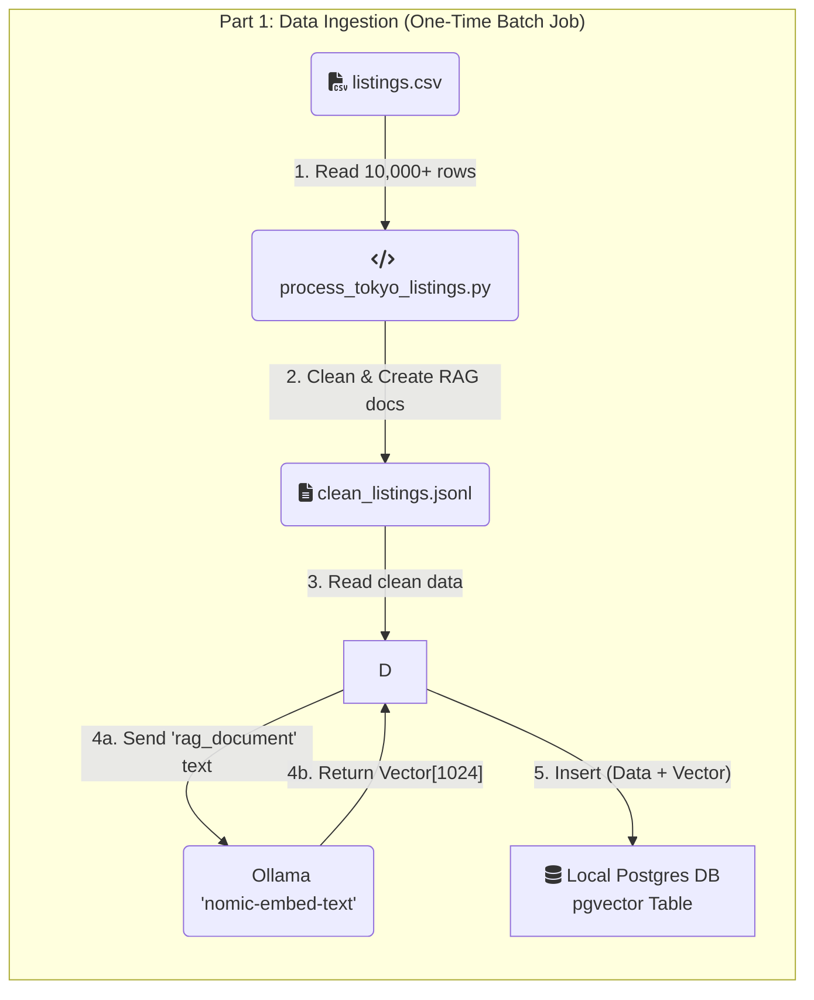

## Tokyo Hotel AI Chatbot (Full-Stack RAG Pipeline)

This project is a full-stack, conversational AI chatbot designed for semantic search of Tokyo hotel and Airbnb listings (static sample data).

Unlike traditional keyword search, this application uses a `Retrieval-Augmented Generation (RAG)` pipeline. This means users can ask questions in natural language (e.g., "*Find me a quiet place near a park with a good kitchen*") and receive answers that are "grounded" in a real, verifiable dataset, preventing AI hallucinations and providing accurate results.

This project was built to demonstrate a modern, end-to-end AI application, from raw data ingestion and vector embedding to a real-time, interactive web interface.

### Architecture & Data Flow

The application is built on a "two-stage" architecture: a one-time Ingestion pipeline and a real-time **Query** pipeline.




### Tech Stack

*   Application Framework: `Streamlit`
*   Containerization: `Docker`, `Docker Compose`
*   Data Pipeline & Processing: `Python`, `pandas`
*   Vector Database: `PostgreSQL` (Local with `pgvector` extension) - *Replaced Supabase for full local control, speed, and privacy.*
*   Embedding Model (Retrieval): `nomic-embed-text` (via `Ollama`) - *High performance with 8k context window.*
*   Generative Model (Generation): `Google Gemini 2.5 Flash` (via `google-generativeai` API)

### Engineering Rationale

This project was built around several key engineering decisions:

1.  **Why RAG?**
    *   Grounding: The RAG architecture prevents the generative AI from "hallucinating" or making up hotels. All answers are grounded in the context retrieved from the database.
    *   Scalability: The knowledge base (the hotel listings) is decoupled from the reasoning engine (the LLM). We can update the hotel data without having to retrain or fine-tune the model.

2.  **Why a Local Embedding Model via Ollama?**
    *   **Cost**: Using a local model like `nomic-embed-text` served via Ollama is free, both for the one-time ingestion of 10,000+ documents and for every real-time user query.
    *   **Performance**: The model is highly efficient, and running it as a separate service with Ollama allows for dedicated resource management.
    *   **Flexibility**: Ollama makes it simple to swap out and experiment with different open-source embedding models.
    *   **Consistency** (The Golden Rule): The same model is used to embed the documents for storage and to embed the user's query at runtime. This consistency is essential for the vector search to find relevant matches.

3.  **Why Local Postgres instead of Supabase?**
    *   **Simplicity & Speed**: Running the database locally in Docker next to the application reduces latency and external dependencies.
    *   **Cost**: It's completely free and doesn't rely on cloud tier limits.
    *   **Privacy**: All data stays within your controlled environment.

3.  **Why `nomic-embed-text`?**
    *   **Long Context**: Supports 8192 tokens, eliminating "context length exceeded" errors common with smaller models.
    *   **Quality**: State-of-the-art performance for retrieval tasks.
    *   **Consistency**: We use the same model for both ingestion and query embedding.

3.  **Why `gemini-2.5-flash-lite` for Generation?**

    *   This is a "grounded" summarization task, not a complex creative task. `2.5-flash-lite` offers the perfect trade-off of speed and cost, providing a fast, conversational feel to the chat interface while remaining highly economical.

4.  **Why Docker?**
    *   **Reproducibility**: Docker containers bundle the application and its dependencies, ensuring that it runs the same way everywhere, from local development to production.
    *   **Simplified Setup**: A single `docker-compose up` command is all that's needed to build and run the entire application stack, eliminating complex local setup and dependency issues.
    *   **Isolation**: The application runs in an isolated environment, preventing conflicts with other projects or system-wide packages.

### How to Run This Project

You can run this project in two modes:

#### Option 1: Easy Setup (Self-Contained in Docker)
Best for getting started quickly. Everything runs in Docker containers.
*   **Pros**: No setup required on your machine.
*   **Cons**: Slower on macOS (Runs Ollama on CPU).

1.  **Start Services**:
    ```bash
    docker-compose up -d
    ```

2.  **Ingest Data**:
    ```bash
    docker-compose run --rm app python ingest_data.py
    ```

#### Option 2: Native Performance (Recommended for macOS)
Best for speed. Connects Docker to the Ollama app running natively on your Mac (uses GPU).

1.  **Prerequisites**:
    *   Install [Ollama](https://ollama.com/) on your Mac.
    *   Pull the model: `ollama pull nomic-embed-text`
    *   **Crucial Step**: Configure Ollama to accept external connections.
        *   Run in terminal: `launchctl setenv OLLAMA_HOST "0.0.0.0"`
        *   Restart the Ollama app.

2.  **Start Services**:
    ```bash
    docker-compose -f docker-compose.native.yml up -d
    ```

3.  **Ingest Data**:
    ```bash
    docker-compose -f docker-compose.native.yml run --rm app python ingest_data.py
    ```

4.  **Run the App**:
    ```bash
    # For Option 1
    docker-compose up

    # For Option 2
    docker-compose -f docker-compose.native.yml up
    ```

Open your browser to `http://localhost:8501`.

### Option 3: Logic on Mac (GPU), Database on Server (Hybrid)
This is the **best setup** if your server is slow (low CPU/RAM) but you want to host the DB there. You run the heavy embedding generation on your Mac and send the data to the server's database.

1.  **On the Server**:
    Start only the database:
    ```bash
    # Ensure port 5435 is open
    docker-compose -f docker-compose.native.yml up -d db
    ```

2.  **On your Mac**:
    Run the ingestion script, pointing it to your server's IP:
    ```bash
    # Replace 192.168.1.XX with your Server's LAN IP
    docker-compose -f docker-compose.native.yml run --rm \
      -e DB_HOST=192.168.1.XX \
      -e DB_PORT=5435 \
      app python ingest_data.py
    ```

3.  **On the Server**:
    Once ingestion is done, start the app:
    ```bash
    docker-compose -f docker-compose.native.yml up -d
    ```

### Future Implementation

*   **Local LLM Support**: Switch to a fully local generation model (e.g., `Llama 3` or `Mistral` via Ollama) for complete privacy and offline capability. This is ideal for powerful hosts (e.g., M-series Macs), while the current API approach is better for low-spec servers.
*   Chat History: Implement conversational memory so the user can ask follow-up questions.
*   More Filters: Add filters for amenities, room type, etc.

The chatbot now supports price-based filtering and generates clickable links for properties.
