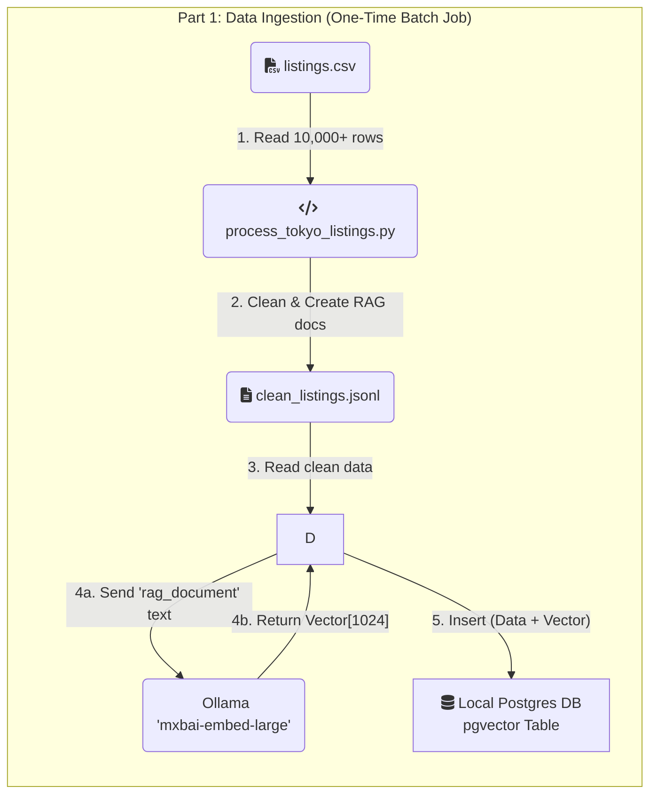
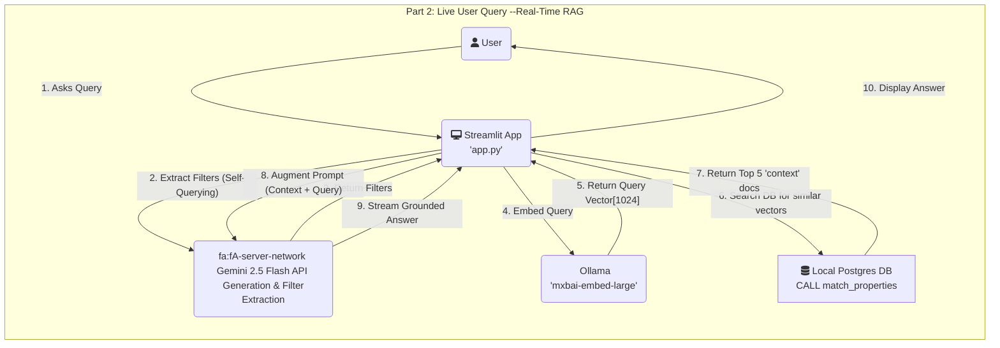

## Tokyo Hotel AI Chatbot (Full-Stack RAG Pipeline)

This project is a full-stack, conversational AI chatbot designed for semantic search of Tokyo hotel and Airbnb listings (static sample data).

Unlike traditional keyword search, this application uses a `Retrieval-Augmented Generation (RAG)` pipeline. This means users can ask questions in natural language (e.g., "*Find me a quiet place near a park with a good kitchen*") and receive answers that are "grounded" in a real, verifiable dataset, preventing AI hallucinations and providing accurate results.

This project was built to demonstrate a modern, end-to-end AI application, from raw data ingestion and vector embedding to a real-time, interactive web interface.

### Architecture & Data Flow

The application is built on a "two-stage" architecture: a one-time Ingestion pipeline and a real-time **Query** pipeline.





### Tech Stack

*   Application Framework: `Streamlit`
*   Containerization: `Docker`, `Docker Compose`
*   Data Pipeline & Processing: `Python`, `pandas`
*   Vector Database: `PostgreSQL` (Local with `pgvector` extension)
*   Embedding Model (Retrieval): `mxbai-embed-large` (via `Ollama`)
*   Generative Model (Generation): `Google Gemini 2.5 Flash` (via `google-generativeai` API)

### Engineering Rationale

This project was built around several key engineering decisions:

1.  **Why RAG?**
    *   Grounding: The RAG architecture prevents the generative AI from "hallucinating" or making up hotels. All answers are grounded in the context retrieved from the database.
    *   Scalability: The knowledge base (the hotel listings) is decoupled from the reasoning engine (the LLM). We can update the hotel data without having to retrain or fine-tune the model.

2.  **Why a Local Embedding Model via Ollama?**
    *   **Cost**: Using a local model like `mxbai-embed-large` served via Ollama is free, both for the one-time ingestion of 10,000+ documents and for every real-time user query.
    *   **Performance**: The model is highly efficient, and running it as a separate service with Ollama allows for dedicated resource management.
    *   **Flexibility**: Ollama makes it simple to swap out and experiment with different open-source embedding models.
    *   **Consistency** (The Golden Rule): The same model is used to embed the documents for storage and to embed the user's query at runtime. This consistency is essential for the vector search to find relevant matches.

3.  **Why `gemini-2.5-flash-lite` for Generation?**

    *   This is a "grounded" summarization task, not a complex creative task. `2.5-flash-lite` offers the perfect trade-off of speed and cost, providing a fast, conversational feel to the chat interface while remaining highly economical.

4.  **Why Docker?**
    *   **Reproducibility**: Docker containers bundle the application and its dependencies, ensuring that it runs the same way everywhere, from local development to production.
    *   **Simplified Setup**: A single `docker-compose up` command is all that's needed to build and run the entire application stack, eliminating complex local setup and dependency issues.
    *   **Isolation**: The application runs in an isolated environment, preventing conflicts with other projects or system-wide packages.

### How to Run This Project

You can run this project in two modes:

#### Option 1: Easy Setup (Self-Contained in Docker)
Best for getting started quickly. Everything runs in Docker containers.
*   **Pros**: No setup required on your machine.
*   **Cons**: Slower on macOS (Runs Ollama on CPU).

1.  **Start Services**:
    ```bash
    docker-compose up -d
    ```

2.  **Ingest Data**:
    ```bash
    docker-compose run --rm app python ingest_data.py
    ```

#### Option 2: Native Performance (Recommended for macOS)
Best for speed. Connects Docker to the Ollama app running natively on your Mac (uses GPU).

1.  **Prerequisites**:
    *   Install [Ollama](https://ollama.com/) on your Mac.
    *   Pull the model: `ollama pull nomic-embed-text`
    *   **Crucial Step**: Configure Ollama to accept external connections.
        *   Run in terminal: `launchctl setenv OLLAMA_HOST "0.0.0.0"`
        *   Restart the Ollama app.

2.  **Start Services**:
    ```bash
    docker-compose -f docker-compose.native.yml up -d
    ```

3.  **Ingest Data**:
    ```bash
    docker-compose -f docker-compose.native.yml run --rm app python ingest_data.py
    ```

4.  **Run the App**:
    ```bash
    # For Option 1
    docker-compose up

    # For Option 2
    docker-compose -f docker-compose.native.yml up
    ```

Open your browser to `http://localhost:8501`.

### Future Implementation

*   Chat History: Implement conversational memory so the user can ask follow-up questions (e.g., "Which one of those has WiFi?").

The chatbot now supports price-based filtering (e.g., "Find me a place in Shinjuku for under 15,000 JPY.").
The output format has also been improved: hotel names are now clickable links to their respective listings, and separate URL lists are no longer displayed.
