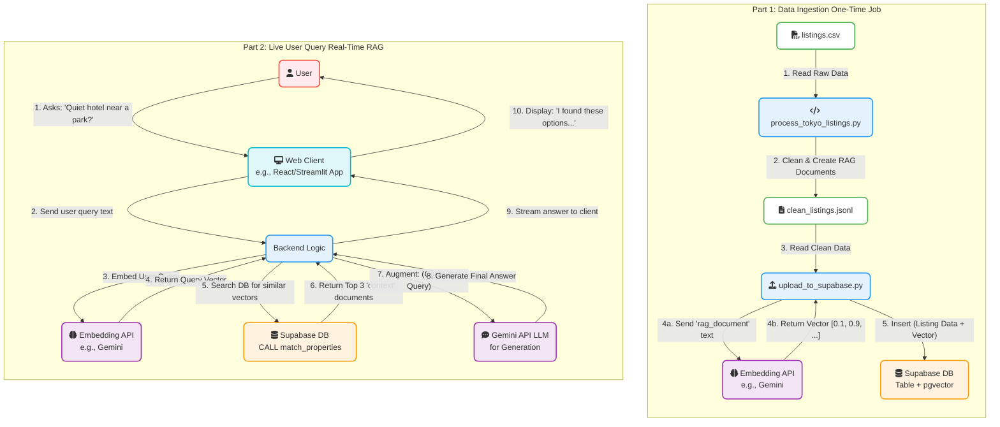

```mermaid

graph TD
    %% Define Styles
    classDef default fill:#f9f9f9,stroke:#333,stroke-width:2px,rx:8,ry:8;
    classDef file fill:#fff,stroke:#4CAF50,stroke-width:2px,rx:8,ry:8,color:#333;
    classDef script fill:#e3f2fd,stroke:#2196F3,stroke-width:2px,rx:8,ry:8,color:#333;
    classDef db fill:#fff3e0,stroke:#ff9800,stroke-width:2px,rx:8,ry:8,color:#333;
    classDef api fill:#f3e5f5,stroke:#9c27b0,stroke-width:2px,rx:8,ry:8,color:#333;
    classDef client fill:#e0f7fa,stroke:#00bcd4,stroke-width:2px,rx:8,ry:8,color:#333;
    classDef user fill:#ffebee,stroke:#f44336,stroke-width:2px,rx:8,ry:8,color:#333;

    %% --- Part 1: Data Ingestion (One-Time Batch Job) ---
    subgraph "Part 1: Data Ingestion One-Time Job"
        direction TB
        A[fa:fa-file-csv listings.csv]:::file
        B(fa:fa-code process_tokyo_listings.py):::script
        C[fa:fa-file-alt clean_listings.jsonl]:::file
        D(fa:fa-upload upload_to_supabase.py):::script
        E(fa:fa-brain Embedding API <br> e.g., Gemini):::api
        F[fa:fa-database Supabase DB <br> Table + pgvector]:::db

        A -- "1. Read Raw Data" --> B
        B -- "2. Clean & Create RAG Documents" --> C
        C -- "3. Read Clean Data" --> D
        D -- "4a. Send 'rag_document' text" --> E
        E -- "4b. Return Vector [0.1, 0.9, ...]" --> D
        D -- "5. Insert (Listing Data + Vector)" --> F
    end

    %% --- Part 2: Live User Query (Real-Time RAG) ---
    subgraph "Part 2: Live User Query Real-Time RAG"
        direction TB
        G(fa:fa-user User):::user
        H(fa:fa-desktop Web Client <br> e.g., React/Streamlit App):::client
        I(fa:fa-brain Embedding API <br> e.g., Gemini):::api
        J[fa:fa-database Supabase DB <br> CALL match_properties]:::db
        K(fa:fa-comment-dots Gemini API LLM <br> for Generation):::api
        L(Backend Logic):::script

        G -- "1. Asks: 'Quiet hotel near a park?'" --> H
        H -- "2. Send user query text" --> L
        L -- "3. Embed User Query" --> I
        I -- "4. Return Query Vector" --> L
        L -- "5. Search DB for similar vectors" --> J
        J -- "6. Return Top 3 'context' documents" --> L
        L -- "7. Augment: (Context + Query)" --> K
        K -- "8. Generate Final Answer" --> L
        L -- "9. Stream answer to client" --> H
        H -- "10. Display: 'I found these options...'" --> G
    end

```